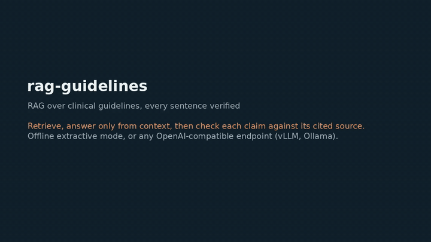

# rag-guidelines

**Retrieval-augmented generation over clinical guidelines and drug labels, with every answer verified against its cited source.** It retrieves the relevant passages, answers only from them, and then checks each sentence of the answer against the chunk it cites, flagging anything unsupported or any number that is not in the source. Built on a neutral, OpenAI-compatible stack (vLLM, Ollama, TGI, or any hosted API), with an offline mode that needs no key.

## Demo



Two questions answered from the bundled corpus, with the retrieved sources, their scores, and the per-sentence check. The video is on [anhduongvo.github.io](https://anhduongvo.github.io/projects/agentic-tooling/).

## Why

A model can retrieve the right guideline passage and still state a dose the passage does not mention. This project adds a verification step after generation: every sentence is checked against the chunk it cites (content overlap and exact numbers), and unsupported sentences are flagged.

## How it works

1. **Retrieve** the top passages with a small, dependency-free TF-IDF retriever.
2. **Generate** an answer that cites each passage as `[cite:<id>]`. Offline mode is extractive and always grounded; live mode calls any OpenAI-compatible endpoint with a strict "answer only from context" prompt.
3. **Verify** every sentence against its cited chunk: enough content words must overlap, and every number must appear in the source. Unsupported sentences are flagged.

## Quickstart

```bash
pip install -e ".[dev]"

rag ask "what is the maximum metformin dose?"     # offline, no key
rag corpus                                          # list the (synthetic) sources
```

Example: the answer "The maximum recommended daily dose of metformin is 2550 mg ... [cite:met-1]" is checked against chunk `met-1`; a fabricated "9999 mg [cite:met-1]" is flagged because the number is not in the source.

## Live generation (neutral stack)

```bash
RAG_OFFLINE=0
RAG_BASE_URL=http://localhost:8000/v1   # vLLM / Ollama / TGI / hosted, your choice
RAG_API_KEY=...                         # if your endpoint needs one
RAG_MODEL=your-model-name
rag ask "first-line treatment for hypertension?" --live
```

## A note on the corpus

The bundled corpus is **synthetic**: short guideline- and label-style snippets written for the demo, not copied from any real guideline or label. Replace `corpus.py` (or load from public sources) to use it for real.

## Development

```bash
ruff check .
pytest
```

## License

Apache-2.0.
